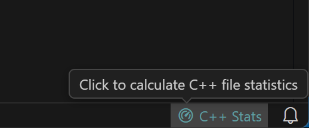
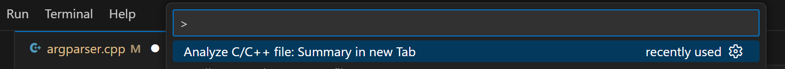
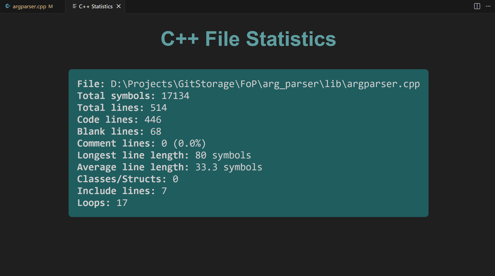

# 📊 C++ File Statistics — VS Code Extension

Расширение добавляет удобную кнопку в строке состояния для просмотра статистики C/C++ файлов прямо в VS Code.
Показывает количество строк кода, пустых строк, комментариев, символов и другую полезную информацию.

## ✨ Возможности

Анализ текущего открытого C/C++ файла

Подсчёт:

- количества символов

- строк в файле

- строк кода

- пустых строк

- строк-комментариев ```( // и /* */ )```

- длины наибольшей и наименьшей строки

- количества включений #include

- количества структур и классов

- количества циклов ```(for и while)```

Отображение результата в приятном Webview окне

## 📦 Установка

### GitHub Releases

1. Загрузите и распакуйте файл .vsix из [раздела Releases](https://github.com/LMorsio/vscode-cpp-stats/releases/)

2. Откройте VS Code

3. Перейдите в Extensions

4. Выберите **Install from VSIX**

### VSCode Extensions Marketplace

1. Откройте VS Code

2. Перейдите в Extensions

3. Найдите [C++ File Stats](https://marketplace.visualstudio.com/items?itemName=morsio.vscode-cpp-stats)

4. Установите расширение

## ▶️ Использование

1. Откройте любой C или C++ файл:

```
.c .cpp .cc .cxx .h .hpp
```

2. Нажмите кнопку **C++ Stats** в строке состояния

3. В новой вкладке появится подробная информация о файле

#### Альтернативный вариант

При открытом C или C++ файле запустите палитру команд (Ctrl+Shift+P) и выполните
```
Analyze C/C++ file: Summary in new Tab
```

## 📁 Пример работы расширения

1. Кнопка в строке состояния <br>


2. Вызов через палитру команд <br>


3. Результат анализа файла <br>


## 🌐 Системные Требования

1. Python 3.x

2. VS Code 1.74.0+

## ⚙️ Самостоятельная компиляция

Следуйте следующим шагам, если хотите самостоятельно скомпилировать и собрать проект:

1. Установите [Node.js](https://nodejs.org/en) + npm и проверьте установку:
```
node -v
npm -v
```
2. С помощью npm установите VS Code Extension Manager (vsce)
```
npm install -g @vscode/vsce
```
3. Склонируйте репозиторий
```
git clone https://github.com/LMorsio/vscode-cpp-stats.git
cd vscode-cpp-stats
```
4. Установите зависимости
```
npm install
```
5. Соберите проект (рекомендуемые инструкции для сборщика можно посмотреть в [tsconfig.json](tsconfig.json))
```
npm run compile
```
6. Запустите в «Developer Mode» в VS Code
(**Нажмите F5**)<br>
При запросе выберите в качестве среды отладки *Extension Development Host*.
VS Code откроет новое окно для отладки.

## 🔑 Лицензия

[MIT License](LICENSE)

Copyright © 2025 Leander Morsio

```
Лобанов Максим Станиславович M3109
```
